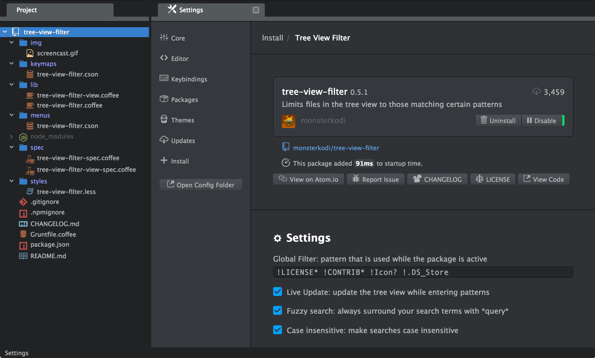

# tree-view-filter

Limits files in the tree-view to those matching certain patterns.

<!--

-->

## Usage

Press `ctrl-alt-shift-f` or invoke `Tree View Filter:Activate` to focus the filter editor, 
enter your pattern and press `enter`/`return` to confirm.

The filter shows only files that match the provided pattern(s): 
e.g. `md coffee` shows all files that have *md* or *coffee* in their filename.

You can reverse the search by prepending an exclamation mark: 
e.g. `!*.md !.*` hides all *markdown* and *dotfiles*.

Note that the `Fuzzy search` option only works in the first case.

To restore the tree view to its unfiltered state:  
either press `escape` when the filter has focus or click on the `(x)` button to the right.

## Credits

* file pattern matching by [minimatch](https://www.npmjs.com/package/minimatch)
* case insensitive and fuzzy option by [ruleb](https://github.com/ruleb)

[atom package](https://atom.io/packages/tree-view-filter)
